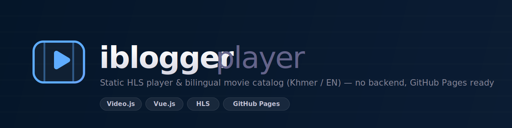

<div align="center">



<br/>

**A single-page, static HLS video player & movie catalog — no backend, no build step, GitHub Pages ready.**

<br/>

[](https://github.com/videojs/video.js)
[](https://pages.github.com/)
[](#)


[**Live demo**](https://openquide.github.io/iblogger-player/) · [Usage](#-usage) · [How it works](#%EF%B8%8F-how-it-works) · [Deploy](#-deploy-github-pages) · [Build the catalog](#-building-the-catalog)

</div>

---

## ✨ Features

- 🎬 **Two modes in one page** — a browsable **movie catalog** (home) and a focused **player** view.
- 📺 **Retro CRT design** — dark, glassy Apple-inspired UI with a CRT-TV bezel, scanlines, and a power LED.
- 🔌 **Pure static** — one `index.html` + a JSON `db/`. No server, no framework, no build tooling at runtime.
- ⚡ **HLS streaming** and robust playback via [Video.js](https://github.com/videojs/video.js).
- 🎛️ **Polished controls** through Video.js — custom quality menu, speed selection, PiP, fullscreen.
- 🗂️ **Catalog browsing** — 150 titles with search, genre filter, sort, and pagination (20 / 50 / 100 per page).
- 📑 **Episode lists** — per-title episodes with an `END` badge on finales and **auto-play next**.
- 🔗 **Related titles** — suggestions computed by shared genre.
- 🌐 **Bilingual** — English + Khmer (ខ្មែរ) titles and descriptions throughout.
- 🛡️ **XSS-safe** — all dynamic text is rendered via `textContent`; URLs and user-supplied params are never injected as HTML.
- 📦 **Lightweight data** — a 2 MB source export is split into a **53 KB index** + per-movie files, so the catalog loads fast and detail is fetched on demand.

---

## 🚀 Usage

The page has two modes, chosen by the URL query string.

### 1. Catalog mode (default)

Open the site with no parameters to browse the full catalog:

```
https://openquide.github.io/iblogger-player/
```

Search, filter by genre, sort, and click a title to open it.

### 2. Player mode — by catalog ID

```
https://openquide.github.io/iblogger-player/?id=<SLUG>
```

Loads a title from `db/<slug>.json`, shows its episode list, and plays the first episode.

### 3. Player mode — direct stream (no catalog)

```
https://openquide.github.io/iblogger-player/?src=<M3U8_URL>&title=<TITLE>
```

Backward-compatible direct-play mode for any `.m3u8` URL.

| Param   | Mode   | Required | Meaning                                          |
| :------ | :----- | :------: | :----------------------------------------------- |
| `id`    | catalog |    —     | Movie slug; loads `db/<id>.json`                 |
| `src`   | direct  |    —     | URL of the `.m3u8` (HLS) stream to play          |
| `title` | direct  | optional | Title shown above the player and in the tab      |

> **Example (direct):** `?src=https://example.com/stream/index.m3u8&title=Episode%201`

---

## 🏗️ How it works

```
┌─────────────────────────────────────────────────────────┐
│  index.html  (UI · routing · player · catalog logic)     │
│      │                                                    │
│      ├─ no params ──► fetch db/index.json ──► catalog grid│
│      ├─ ?id=slug  ──► fetch db/<slug>.json ─► episode list│
│      └─ ?src=url  ──► play stream directly                │
│                                                           │
│  Video.js (CDN, SRI-pinned) ──► plays media & custom skin │
└─────────────────────────────────────────────────────────┘
```

- **Routing** is entirely client-side off the query string — works on a static host.
- **Data** lives in [`db/`](db/): `index.json` (slim catalog) + one `<slug>.json` per title (full detail + episode URLs).
- **CDN dependencies** (Video.js, Google Fonts) are loaded over HTTPS and pinned with [Subresource Integrity](https://developer.mozilla.org/en-US/docs/Web/Security/Subresource_Integrity).
- **All paths are relative** (`db/...`, not `/db/...`), so the site works correctly under a project-page subpath.

---

## 📦 Project structure

```
iblogger-player/
├── index.html          # the entire app (markup + styles + logic)
├── build-db.py          # splits the source export into db/
├── db/
│   ├── index.json       # slim catalog: slug, title, poster, year, rating, genres, episodeCount
│   └── <slug>.json      # full detail: + description, language, episodes[]
├── .github/banner.svg   # README banner
└── README.md
```

**Genres:** `ACTION` · `ANIMATION` · `COMEDY` · `DOCUMENTARY` · `DRAMA` · `FANTASY` · `HORROR` · `ROMANCE` · `SCI_FI` · `THRILLER`

---

## 🔧 Building the catalog

The `db/` folder is generated from a single exported JSON by `build-db.py`:

```bash
python3 build-db.py movies-export-YYYY-MM-DDThh-mm-ss.json
```

This writes `db/index.json` and one `db/<slug>.json` per title. The source export is **input only** — it is not deployed (and is `.gitignore`d). Re-run this whenever the catalog changes.

---

## 🌐 Deploy (GitHub Pages)

1. Commit `index.html`, `db/`, and `build-db.py`, then push.
2. **Settings → Pages → Source: `main` (or `master`) / root**.
3. Your player goes live at `https://<user>.github.io/iblogger-player/`.

> No `.nojekyll` is required — there are no underscore-prefixed paths.

---

## ⚠️ Known limitation: stream CORS

The browser can only play a stream if the **`.m3u8` host sends `Access-Control-Allow-Origin`** headers. A static page cannot proxy around this. If a stream shows a *"could not load"* error, it is almost always the **source server's CORS policy** (or the link being offline) — not a bug in the player.

---

## 🙏 Built with

[Video.js](https://videojs.com) · [Inter](https://rsms.me/inter/) + [Siemreap](https://fonts.google.com/specimen/Siemreap) fonts · GitHub Pages

<div align="center">

<sub>Static · no backend · GitHub Pages friendly</sub>

</div>
